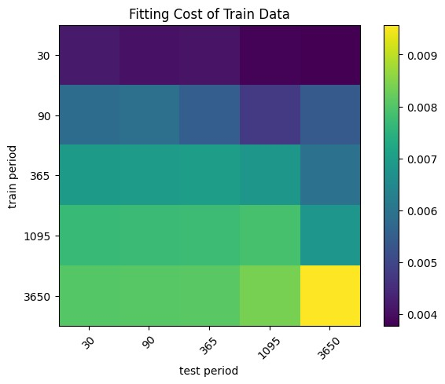
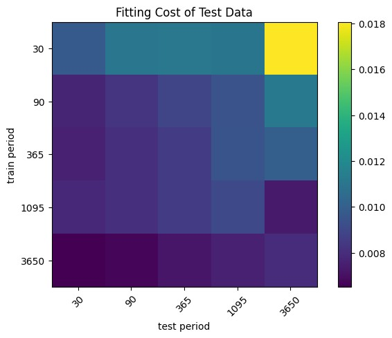
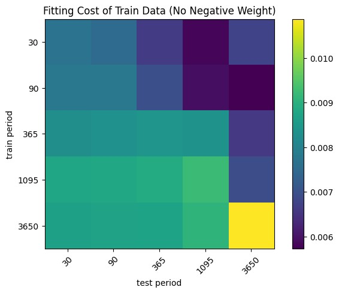
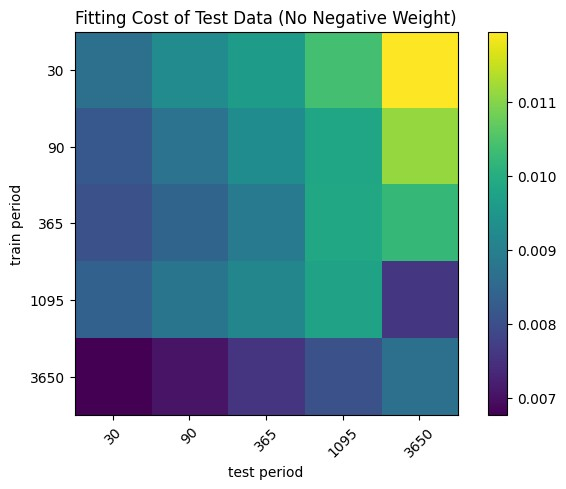
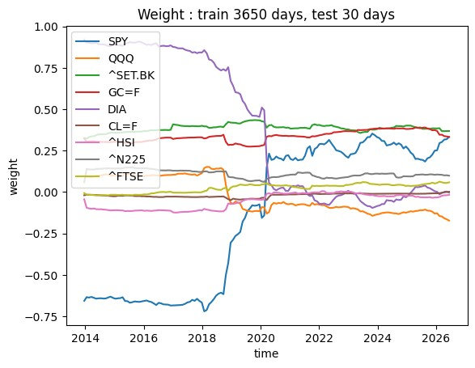
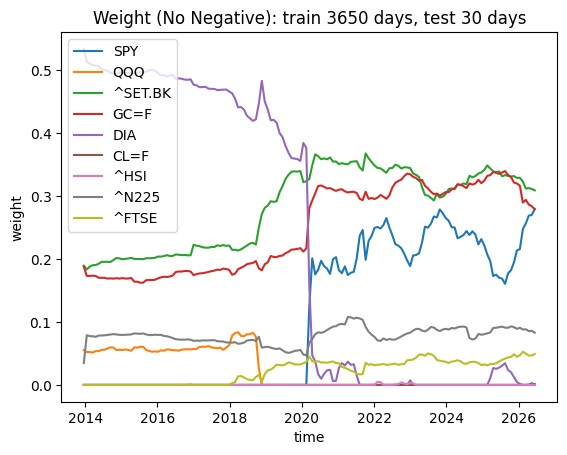
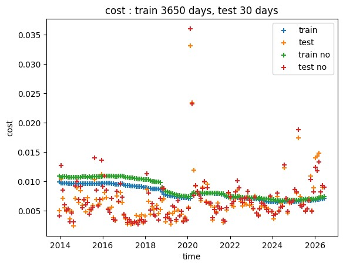
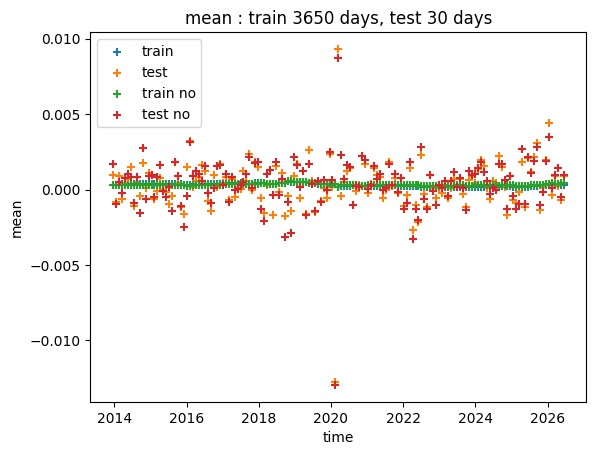
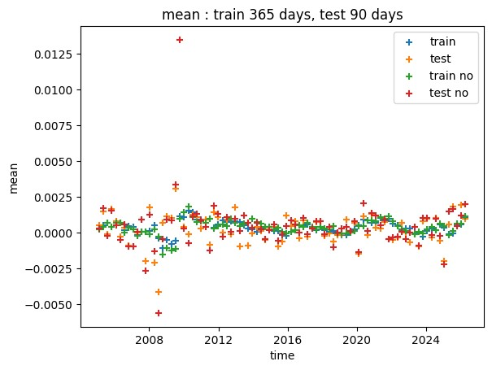

# Minimal Variance Investment Portfolio Optimization

This project aims to find optimal train and test period for weight of holding in investment portfolio, using minimal variance method. The effect of some economic crisis on holding strategy also shown in our results.
	
This project is for educational purposes only and does not constitute investment advice.

## Motivation

One way to increase our wealth passively is in investment. The problem apart from what to invest in is how much to invest in each asset. The proportion of holding assets can be solved by modern portfolio theory, such as mean-variance method. In this case, I use minimal variance method, which minimizes fluctuation and make return more stable, rather than trade off more return with more fluctuation.

In order to find a good strategy on holding asset, we need data from the past to find mean return and covariance between assets, and also test it with data future, which is the same as train-test splitting in data. Even though, more training data tend to provide more accuracy, so more favorable, it also included data during economic crisis which does not happen often. I wonder if this affects accuracy on the model of mean return and covariance. So, in this project, I’m going to find optimal period of train and test data for accurate outcome of mean return, and also investigate effect of economic crisis if it is included in train data.

## Methodology

All data process on **Python**, mainly using package **Pandas**, and also **Matplotlib** for plotting graph.
1.	Download data from package yfinance on following assets: SPY, QQQ, ^SET.BK, GC=F, DIA, CL=F, ^HSI, ^N225, ^FTSE. The data interval end on 1st August 2026
2.	Download and transform currency unit of closed value of each asset into THB. At this step, I found that the earliest date in data is 1st December 2003.
3.	Calculate return from value of each asset.
4.	Split train and test data set into various period, then find cost of fitting from minimal variance method. The periods are 1 month (30 days), 3 months (90 days), 1 year (365 days), 3 years (1095 days), and 10 years (3650 days).
  - The train and test data set are adjacent in time.
  - When multiple train-test pair are possible, cost of fitting and mean return will be averaged.
  - Weight or proportion of each asset has both allow negative weight and not allow negative cases.
5.  Plot heat map of cost of fitting against each duration of training and testing.

## Results

### Cost of Fitting

For cost of fitting in training dataset, it seems to prefer short duration of training, and less so on short test period. This may be because the short duration of training makes the data the timeliest. The less training data, the less cost of fitting it becomes, but also prone to overfitting. On the other hand, more training data produce more cost of fitting, which can be a sign of underfitting when compared with fitting cost of testing data. 

For the cost of fitting of testing data, trend in the result seem to opposite to training data. The less cost of fitting on testing data means the model is suitable, not overfitting or underfitting. It prefers longer training period, which is 10 years. The secondary trend is shorter testing period, which is 1 month.

For cost of fitting of training data but negative weights are not allowed, the cost increased substantially compared with negative weight allow. This happened because the weights are no longer the optimal one. The longer the testing period, the more fluctuate the results, and more pronounced than negative weight allowed case. This is added into consideration because it is applicable for retail investors because they cannot borrow stocks to sell.

This shows that when training period is 10 years, and testing period is 1 month, the cost decreased substantially compared with 3 years. This trend is more pronounced than negative weight allowed case.

### Weight of Holding

From weight of holding, something appears to have happened in 2018 that make assets namely DIA and QQQ become less attractive, while make SPY more favorable to hold. These assets are indexes from American stock markets, from narrower on market DIA (30 stocks) and QQQ (100 stocks), into wider on market SPY (500 stocks). The cause requires further investigation.

When negative weights of holding are not allowed, some assets namely SET index and GC=F seem to be more favorable. This happened because they filled the allocation previously held by unfavorable assets. This trend does not show when negative weights are allowed. 

### Effect of Economic Crisis

On the legend of following graphs, “train” (blue +) represent value (cost of fitting or mean return) from training period, which is before the time on plot, “test” (orange +) is value of testing period, which is after time on plot. For the case where no negative weight allowed, they labelled as “train no” (green +) and “test no” (red +).

When considering the best strategy overtime, which is training on 10 years data, but test on 1 month of future data, the cost of fitting spiked around COVID pandemic time, which is around year 2020. In other times, the cost of fitting in test period are lower than training period.

Note that cost of fitting is overall standard deviation of portfolio return, which derived from covariance matrix between assets. We usually get advice to diversify portfolio on assets that are not correlated with each other, so we can get stable return. High cost of fitting reflects that correlation between assets changed during economic crisis. 

In terms of mean return, the returns predicted from train data are a slightly positive, while returns produced from test data are more scattered than the mean from train data. There are some losses at around COVID period. The return fluctuated on both positive and negative side. Seemingly, overall return of portfolio restored to normal, which is positive, by applying the same strategy on long duration. 

The large fluctuation during economic crisis also happened in some results on other train and test period. However, in this case, train period is 1 year, and test period is 3 months, 2008 economic crisis is pronounced but not COVID pandemic. The large fluctuation during economic crisis may not show as pronounced in other combinations of train and test period.

## Conclusion

The results prefer long training period and shorter testing period, means use lots of data in the past for optimize holding weights in near future. In time of COVID pandemic crisis, it affects negatively on return of portfolio, but the return will be restored to normal in the long term.

## Author

I’m Surawut Pawutinan, and my nickname is Junior. This is my [LinkedIn](https://www.linkedin.com/in/surawut-paw-junior/), and my [GitHub](https://github.com/junior-surawutp).
